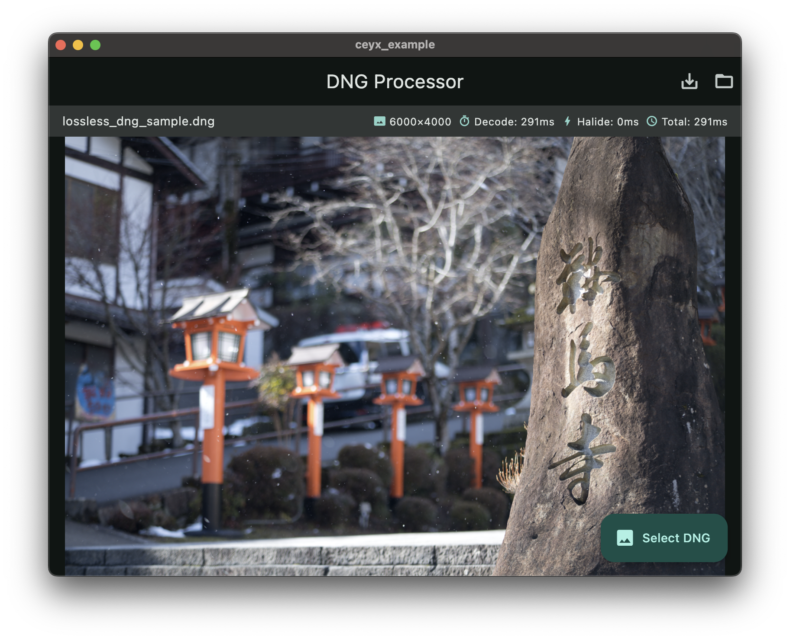
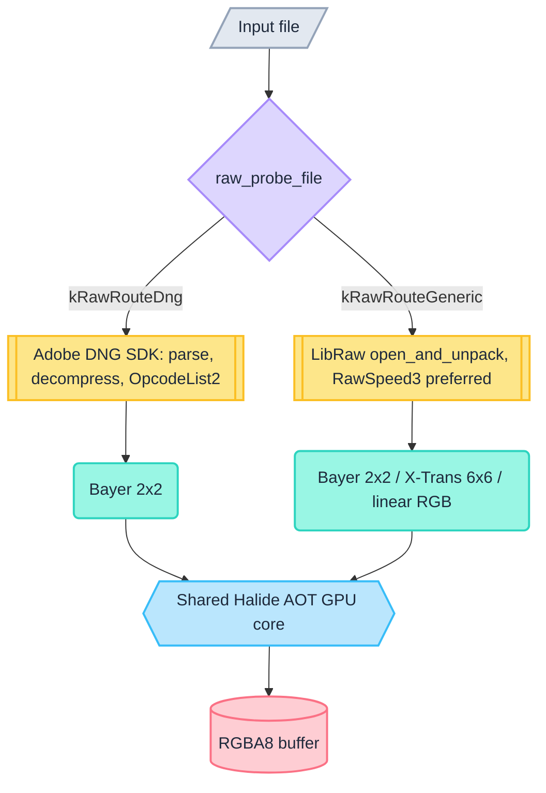
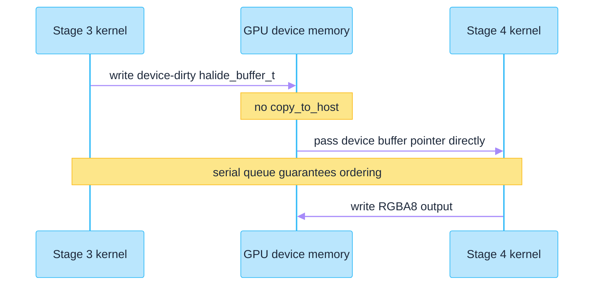

# Ceyx

Ceyx is a cross-platform, GPU-accelerated camera RAW decoding engine written in C++ and
Halide, packaged as a Flutter FFI plugin. It decodes DNG through the Adobe DNG SDK and a
broad range of proprietary RAW containers through LibRaw/RawSpeed3, runs demosaic, lens
correction and colour rendering as ahead-of-time compiled GPU kernels, and hands the
result to Dart without a memory copy.



*The bundled Flutter demo app (`app/`) decoding a 6000×4000 lossless DNG. The status bar
reports 291 ms for a cold first decode on an Apple M3 Ultra running macOS 15.6.1
(release build, 2026-08-26). This is a cold in-app measurement, not the warmed benchmark
figure in [Performance](#performance).*

---

## Table of contents

- [Why Ceyx](#why-ceyx)
- [Sister project: Halcyon](#sister-project-halcyon)
- [Supported formats and decoder backends](#supported-formats-and-decoder-backends)
- [Camera coverage](#camera-coverage)
- [Pipeline architecture](#pipeline-architecture)
- [FFI bridge and zero-copy design](#ffi-bridge-and-zero-copy-design)
- [GPU backends and platform support](#gpu-backends-and-platform-support)
- [Performance](#performance)
- [Precision and quality gates](#precision-and-quality-gates)
- [Building from source](#building-from-source)
- [Using Ceyx as a Flutter plugin](#using-ceyx-as-a-flutter-plugin)
- [Testing and QA tooling](#testing-and-qa-tooling)
- [Repository layout](#repository-layout)
- [Licensing and third-party attribution](#licensing-and-third-party-attribution)

---

## Why Ceyx

- **Colour fidelity is delegated, not approximated.** DNG parsing, opcode linearization
  and the reference colour maths stay inside the vendored Adobe DNG SDK, so documented
  DNG behaviour is preserved rather than re-implemented from a specification reading.
- **GPU-first, but honest about it.** Demosaic, lens warp and colour/tone rendering run
  as Halide AOT kernels on Metal or Vulkan. Where GPU execution structurally cannot match
  the CPU reference bit-for-bit, the residual is measured, published and explained
  instead of being hidden — see [Precision and quality gates](#precision-and-quality-gates).
- **One kernel set, two GPU APIs, three sensor layouts.** The same Halide generators are
  compiled per platform to Metal or Vulkan, and both decoder frontends converge on the
  same GPU core regardless of whether the file was a DNG, a Bayer RAW, an X-Trans RAW or
  a Foveon X3F.
- **Zero-copy at the Dart boundary.** Decoded RGBA buffers cross into Dart as a view over
  native memory with no `memcpy`, released by a `NativeFinalizer` when the Dart wrapper is
  collected.
- **Engine separated from application.** This repository is the reusable engine and
  plugin; a separate application consumes it under real product constraints.

## Sister project: Halcyon

Halcyon is a separate Flutter photo application that consumes Ceyx as an ordinary pub
`path:` dependency on this repository's `plugin/` directory. It is not a fork or a
subproject. Its Dart code touches exactly one import surface into this engine, and its
build and packaging scripts reference this repository's tree directly — which is why
restructuring work here is coordinated with Halcyon rather than done in isolation.

In short: Ceyx is the decoding engine and Flutter plugin, Halcyon is the real-world
consumer application built on top of it.

---

## Supported formats and decoder backends

Route selection is a byte-level probe of the file header, not a file-extension match.

| Route | Container | Frontend |
|---|---|---|
| DNG | TIFF-based with a `DNGVersion` tag in IFD0 | Adobe DNG SDK |
| Generic RAW | CR2, CR3, NEF, ARW, RAF, ORF, RW2, PEF, IIQ, MRW, X3F and other vendor containers | LibRaw, with RawSpeed3 as its preferred decode backend |

Three decoding libraries are vendored and built from source. They are not interchangeable
alternatives — each owns a distinct part of the problem:

- **Adobe DNG SDK** (`native/third_party/dng_sdk`) owns the DNG route end to end:
  metadata parsing, LJPEG tile decompression, and the OpcodeList linearization and
  lens-correction chain.
- **LibRaw** (`native/third_party/libraw`, gated by `DNG_ENABLE_GENERIC_RAW`) owns the
  generic RAW route: it opens the file and issues a single `unpack()` call.
- **RawSpeed3** (`native/third_party/libraw/RawSpeed3/rawspeed`) is used *inside* that
  LibRaw call as the preferred decoder. Ceyx never calls RawSpeed3 directly.

For the generic route, `LibRawFrontendContext::open_and_unpack()` sets `use_rawspeed` from
a forced-backend enum — `kAuto` tries RawSpeed3 first and silently falls back,
`kRawSpeed3` requires it, `kLibRawNative` disables it — and then reads back which decoder
actually produced the pixels from the `LIBRAW_WARN_RAWSPEED3_PROCESSED` warning bit after
the call. The RawSpeed3-vs-LibRaw decision is therefore observable per file, not assumed.

### Probing

`raw_probe_file()` (`native/src/pipeline/raw_file_router.cpp`) reads a small header window:

- Non-TIFF containers are matched on magic bytes and routed generic immediately:
  `FUJIFILMCCD-RAW` (Fujifilm RAF), `\0MRM` (Minolta MRW), `ftypcrx` / `ftypcr3`
  (Canon CR3), `IIU\0` / `IIRO` / `IIRS` (Phase One IIQ), `FOVb` (Foveon X3F).
- TIFF-based containers (`II`/`MM`, version 42) route to the DNG frontend only if IFD0
  carries the `DNGVersion` tag (id 50706) inside the probe window; otherwise they route
  generic. A DNG whose IFD0 sits outside the window is still decoded correctly by LibRaw
  — the mismatch surfaces as a diagnostic, not as a wrong decode.

### Sensor layout classes

Once pixels are unpacked, GPU dispatch keys on the colour-filter layout, never on vendor
or file format. The dispatch is an exhaustive switch with no fallthrough, so an
unrecognized layout cannot silently reach a demosaic kernel.

| Layout | Example sensors | GPU kernel |
|---|---|---|
| Bayer 2×2 (`kRawLayoutClassBayer2x2`) | the RGGB-family majority | `RawBayerDemosaicGenerator` |
| X-Trans 6×6 (`kRawLayoutClassXTrans6x6`) | Fujifilm X-Trans | `RawXTransDemosaicGenerator` |
| Linear RGB / no CFA (`kRawLayoutClassLinearRgb`) | Foveon X3F | `RawLinearRgbNormalizeGenerator` (normalize only, no demosaic) |

The X-Trans branch builds its 36-entry CFA pattern from LibRaw's `idata.xtrans_abs` when
`filters == 9`.

The linear-RGB branch is deliberately *not* a Foveon-specific check: the predicate is
`filters == 0 && colors == 3`, so any decoder returning a three-component interleaved
buffer reaches it and is treated identically. Foveon X3F decoding itself uses the
Kalpanika x3f-tools bundled inside LibRaw, force-enabled via `ENABLE_X3FTOOLS`.

The DNG route uses its own demosaic kernel (`DngDemosaicWarpGenerator`, fused with the
lens warp) rather than `RawBayerDemosaicGenerator` — the two Bayer demosaic
implementations are separate code, not a shared kernel.

## Camera coverage

Camera support for the generic RAW route comes from the vendored RawSpeed3 camera
database, `native/third_party/libraw/RawSpeed3/rawspeed/data/cameras.xml`:

- **1391** `<Camera>` entries
- **71** distinct raw `make=` strings
- **~41** distinct brands after normalizing case, stripping corporate suffixes and
  merging spelling variants

Counting method matters here. A naive `make="Canon"` grep over the whole file returns 399
hits, but only **209** of those are `<Camera>` entries; the remaining 190 are nested
`<ID>` elements mapping alternate model-name strings onto the same camera. All figures
below are scoped to `<Camera make="...">` opening tags.

| Brand | `<Camera>` entries |
|---|---|
| Panasonic | 308 |
| Canon | 209 |
| Nikon | 198 |
| Fujifilm | 131 |
| Sony | 110 |
| Leica | 96 |
| Olympus (incl. OM Digital Solutions) | 76 |
| Pentax | 40 |
| Samsung | 34 |
| Kodak | 32 |
| Phase One | 25 |
| Casio | 21 |
| Ricoh | 20 |
| Hasselblad | 16 |
| Leaf | 14 |
| Minolta / Konica Minolta | 10 |

The remaining long tail is mostly single-entry industrial, machine-vision, action-camera
and mobile-phone sensor makes (ARRI, AVT, Baumer, DJI, GITUP, LG, OnePlus, Sjcam, Sigma,
Sinar, Epson and others). The exact brand total depends on how aggressively spelling
variants are merged; 41 reflects merging OM Digital into Olympus and Konica Minolta into
Minolta.

---

## Pipeline architecture

### The four stages

| Stage | Role | Technology |
|---|---|---|
| 1 | Parse metadata, decompress Bayer tiles (LJPEG) | Adobe DNG SDK + libjpeg |
| 2 | OpcodeList2: linearization, black subtraction, pre-demosaic lens correction | Adobe DNG SDK / Halide opcode kernels |
| 3 | Demosaic Bayer→RGB, fused with `WarpRectilinear` (OpcodeList3) | Halide AOT (Metal / Vulkan) |
| 4 | Camera→sRGB matrix, tone mapping, 8-bit RGBA encode | Halide AOT (Metal / Vulkan) |

### End-to-end dataflow

```mermaid
flowchart LR
    A[/"RAW file bytes"/] --> B[["Stage 1: parse metadata, decompress tiles"]]
    B --> C[["Stage 2: OpcodeList2 linearize, black subtract, lens correct"]]
    C --> D{{"Stage 3: demosaic + fused WarpRectilinear"}}
    D --> E{{"Stage 4: colour matrix, tone map, RGBA8 encode"}}
    E --> F[["extern C dng_decode_and_process"]]
    F --> G[("dart:ffi DngResult")]
    G --> H[["DngDecoderService"]]
    H --> I[("Zero-copy Uint8List view")]
    I --> J(["Flutter widget"])

    classDef input fill:#e2e8f0,stroke:#94a3b8,stroke-width:2px,color:#1e293b
    classDef cpu fill:#fde68a,stroke:#fbbf24,stroke-width:2px,color:#1e293b
    classDef gpu fill:#bae6fd,stroke:#38bdf8,stroke-width:2px,color:#1e293b
    classDef ffi fill:#ddd6fe,stroke:#a78bfa,stroke-width:2px,color:#1e293b
    classDef dart fill:#a7f3d0,stroke:#34d399,stroke-width:2px,color:#1e293b

    class A input
    class B,C cpu
    class D,E gpu
    class F,G ffi
    class H,I,J dart
```



<sub>**Colour** — amber: CPU (Adobe DNG SDK) · sky: GPU (Halide AOT) · violet: FFI boundary · emerald: Dart/Flutter<br/>
**Shape** — parallelogram: file input · subroutine box: library/API call · hexagon: GPU kernel · cylinder: memory buffer · stadium: UI terminal</sub>

### Dual-frontend routing

Both frontends converge on the same GPU core. Routing only decides which library parses
the container and unpacks samples — not which kernels process the pixels.



<sub>**Colour** — violet: route probe · amber: CPU frontends · teal: sensor layout class · sky: shared GPU core · rose: output<br/>
**Shape** — diamond: routing decision · subroutine box: library call · rounded: classification · hexagon: GPU kernel · cylinder: memory buffer</sub>

### GPU device handoff

Stage 3 hands its output to Stage 4 while the buffer is still resident in GPU memory.
There is no `copy_to_host` between them; the Metal serial queue guarantees ordering. All
three generic-route branches (Bayer, X-Trans, linear RGB) call the same shared Stage 4
entry point with the same device-dirty intermediate, so this is not a DNG-only
optimization.



One gotcha is load-bearing here: after `src_buf.crop()`, callers must mutate
`raw_buffer()->dim.min = 0` to match the generator's hard-coded `clamp(x, 0, ext-1)`.
Using `set_min` or `translate` instead triggers a `device_deallocate`.

### Halide AOT generators

All GPU kernels are compiled ahead of time at CMake build time — nothing is JIT compiled
at runtime. Generators live in `native/generators/` and are wired up in
`native/cmake/generators.cmake`.

| Generator | Produces | Role |
|---|---|---|
| `DngDemosaicWarpGenerator.cpp` | `DngDemosaicWarp` | DNG Stage 3, fused demosaic + warp; `strict_float` / `fast_codegen` schedule options |
| `DngDemosaicGenerator.cpp` | `DngDemosaicBilinear` | DNG bilinear demosaic fallback |
| `RectilinearWarpGenerator.cpp` | `RectilinearWarp` | Standalone lens-warp fallback |
| `DngOpcodePolynomialGenerator.cpp`, `DngOpcodePolynomial3Generator.cpp` | Stage 2 opcode kernels | OpcodeList2 `MapPolynomial` on GPU |
| `DngRenderGenerator.cpp` | `DngRenderStage4` and Android / scaled variants | Stage 4 render |
| `RawBayerDemosaicGenerator.cpp` | generic Bayer kernel | fused normalize + bilinear demosaic |
| `RawXTransDemosaicGenerator.cpp` | generic X-Trans kernel | fused normalize + 6×6 demosaic |
| `RawLinearRgbNormalizeGenerator.cpp` | generic linear-RGB kernel | normalize only |

A `research/` subtree holds diagnostics-only variants gated behind `DNG_DIAGNOSTIC_BUILD`;
they are not part of the production kernel set.

## FFI bridge and zero-copy design

```
native/src/ffi/dng_ffi_api.cpp   (extern "C")
  → libdng_decoder_native.dylib / .so
      → plugin/lib/src/dng_bindings.dart   (dart:ffi struct + lookupFunction)
          → plugin/lib/src/dng_decoder_service.dart   (DngDecoderService)
              → Flutter widget
```

**ABI contract.** `DngResult` has six fields and a compile-time pinned layout —
`sizeof(DngResult) == 40` on 64-bit, with `rgba_data` at offset 0, `width` at 8, `height`
at 12, `error_code` at 16, `decode_ms` at 24 and `process_ms` at 32, enforced by
`static_assert` in `native/include/dng_ffi_api.h`. The Dart mirror in `dng_bindings.dart`
must match field-for-field; that pairing is what "byte-exact struct" means in practice.

**Guarded symbol lookup.** Newer exports such as `dng_decode_and_process_sized` and the
generic-RAW entry `raw_decode_and_process` are looked up inside `try`/`catch`, and the
corresponding capability getter reports `false` rather than throwing when an older dylib
lacks the symbol. Adding native entry points therefore does not break older bundles.

**Zero-copy path.** The native `rgba_data` pointer is wrapped as a Dart `Uint8List` view
via `asTypedList` — no `memcpy` on the success path. Ownership then passes to a
`NativeFinalizer` bound to `dng_free_rgba_buffer`, so the native allocation is released
when the Dart wrapper is garbage collected. The surrounding `DngResult` struct is freed in
a `finally` block, with `rgbaData` cleared first so the buffer cannot be double-freed.

**Worker-isolate path.** Because a finalizer-backed view cannot safely cross isolate
boundaries, `decodeOnWorker` copies into Dart-owned bytes and moves them with
`TransferableTypedData`, freeing the native result inside the worker isolate.

**Pooled allocation.** RGBA output buffers are checked out of a pool rather than freshly
allocated per decode, avoiding page-fault cost on warm repeated decodes. Debug counters
(`dng_debug_pool_checked_out`, `dng_debug_rgb_pool_checked_out`) expose outstanding
checkouts for leak detection in test harnesses.

---

## GPU backends and platform support

Ceyx targets exactly two GPU APIs: **Metal** and **Vulkan**. There is no OpenCL or CUDA
code in the tree, and there is no CPU render fallback — a working GPU backend is
mandatory.

Backend selection is a compile-time platform switch, not a runtime capability probe
(`native/src/pipeline/raw_gpu_pipeline.cpp`): Apple platforms get Metal, everything else
gets Vulkan.

| Platform | Halide AOT target |
|---|---|
| macOS / host | `host-metal-no_asserts-no_bounds_query` |
| Android | `arm-64-android-vulkan-vk_int8-vk_int16-vk_int64-no_asserts-no_bounds_query` |
| Windows | `x86-64-windows-vulkan-vk_int8-vk_int16-vk_int64-no_asserts-no_bounds_query` |

`no_asserts` and `no_bounds_query` strip runtime bounds checks from release kernels; the
`vk_int8` / `vk_int16` / `vk_int64` flags are the device contract required by the Vulkan
compute backend.

### Platform status

| Platform | GPU backend | Status |
|---|---|---|
| macOS | Metal | Shipping, verified |
| Android | Vulkan | Shipping, verified |
| Windows | Vulkan | Shipping, verified |
| iOS | Metal | Planned, pending CI/CD |
| Linux | Vulkan | Planned, pending CI/CD |

macOS, Android and Windows each have a native plugin directory with build wiring
(`plugin/macos`, `plugin/android`, `plugin/windows`) and a corresponding Flutter app
target.

The engine is written to be portable to iOS and Linux, and completing both is gated on
finishing the CI/CD pipeline rather than on any known technical blocker — but neither is
verified today. Concretely: `app/ios/` exists as a Flutter runner shell but there is no
`plugin/ios/`, and Linux has only a `qLinux=1` compile-definition branch with no
`app/linux/` or `plugin/linux/`.

### Android: persistent Vulkan pipeline cache

On Android, Halide v21's Vulkan runtime is forked (`native/halide_runtime_fork`, applied
by weak-symbol override) to persist the driver's `VkPipelineCache` across app launches.
Second-launch warmup drops from roughly 1500 ms to 141 ms.

---

## Performance

Every figure below is quoted with its measurement date and hardware. Cold-first-decode,
warm decode and app-cold are different measurement conditions and are not
interchangeable. The warmed matrix numbers are reproduced with:

```bash
python3 native/tests/run_decode_matrix.py --repeat 3
```

### macOS (Metal)

| Measurement | Value | Date / build |
|---|---|---|
| Stage 3 fused, lossless | ~143 ms | 2026-06-13, commit `e40ed7b` |
| Stage 4, lossless | ~31–34 ms | 2026-06-13, commit `e40ed7b` |
| Stage 3, lossy | 0.0 ms | 2026-06-13, commit `e40ed7b` |
| Stage 4, lossy | ~39 ms | 2026-06-13, commit `e40ed7b` |
| End-to-end, lossless (24 MP) | ~177 ms | 2026-07-05 |
| End-to-end, lossy (24 MP) | ~105 ms | 2026-07-05 |

> The repository does not record a chip model for the 2026-06/2026-07 macOS measurements
> above — only "Apple Silicon". Do not assume they were taken on the same machine as the
> demo screenshot.

Separately, the demo-app screenshot at the top of this README is a **cold first decode
inside the GUI app**: 6000×4000 lossless DNG, 291 ms total, on an Apple M3 Ultra running
macOS 15.6.1 (release build, 2026-08-26). It is not comparable to the warmed matrix
numbers without accounting for warmup state.

### Android (Vulkan) — Adreno 750, Vulkan 1.3.128

| Measurement | Value | Note |
|---|---|---|
| Cold first decode | 905.2 ms | down from 1353.7 ms (−33%) |
| Warm decode | 653 ms | steady state, caches populated |
| App-cold | 518–530 ms | fresh process, warm on-disk pipeline cache |
| Pipeline warmup | ~1050 ms | down from ~6153 ms (−83%) |
| Second-launch warmup | 141 ms | down from ~1500 ms, via persistent `VkPipelineCache` |

### Stage-level and per-format detail

- Stage 1 Huffman decode, warm: 87.9 ± 3.8 ms — 74.0% of the warm pipeline total. CPU-side
  decompression, not GPU work, is the dominant cost.
- Stage 4 `repack_src` elimination: 686 ms → 33 ms.
- **Fujifilm X-T5 RAF (40 MP): 1231 ms decompress, against 293 ms for an X-T3 RAF.** The
  gap is an upstream capability gap, not a dispatch problem: the pinned RawSpeed3 revision
  does not support that X-T5 body variant, so it reports `RAWSPEED_UNSUPPORTED` and the
  file automatically falls back to LibRaw's native unpacker. The X-T3 figure is the
  RawSpeed3 path.
- **Foveon X3F (Sigma sd Quattro H, 6208×4160): roughly 1.2–1.5 s per file.** This is an
  estimate — no dedicated timer instruments this path. The bottleneck is the vendored
  x3f-tools single-threaded CPU parse of a 68 MB file; the GPU normalize plus Stage 4
  together account for only tens of milliseconds.

The recurring theme across formats: GPU stages cost tens of milliseconds regardless of
format, and essentially all of the format-to-format variation is CPU-side decompression.

---

## Precision and quality gates

Ceyx measures decode correctness as PSNR against a reference buffer produced by the Adobe
DNG SDK's own CPU arithmetic. In this project's convention, **999 dB is a sentinel meaning
"bit-exact" (maximum absolute pixel difference of 0)**, emitted by `compare_psnr.py` when
two buffers are identical — it is not a physical measurement. Anything below it is a real
signal-to-noise ratio.

| Gate | Threshold | Measured |
|---|---|---|
| 24 MP DNG end-to-end wall clock | ≤ 600 ms | see [Performance](#performance) |
| Lossless Stage 3 (fused demosaic + warp) | ≥ 100 dB | 102.71–102.72 dB |
| Lossless Stage 4 (end-to-end) | ≥ 75 dB | 79.85–79.90 dB |
| Lossy, Stages 1–4 | 999 dB (bit-exact) | 999 dB |
| Generic RAW — Bayer kernel | 999 dB, max_abs 0 | 999 dB, max_abs 0 |
| Generic RAW — X-Trans kernel | — | 131.6–133.36 dB, max_abs 1 |
| Generic RAW — Foveon linear-RGB kernel | 999 dB, max_abs 0 | 999 dB, max_abs 0 |

The lossy path reaches bit-exactness. The lossless DNG path deliberately does not, for two
independent and separately diagnosed reasons.

### Why the lossless path is not bit-exact

**It is not because "the GPU is imprecise."** That intuition was investigated and refuted:
under `strict_float`, byte-comparison of Metal-compiled and CPU-compiled builds of the same
Halide kernels produces *identical* output. Both remaining residuals are
backend-independent.

#### 1. FMA contraction mismatch (Stage 4)

Apple's Metal compiler never auto-fuses multiply-add in this pipeline — Halide v21's Metal
runtime hardcodes `setFastMathEnabled:NO`, confirmed by disassembly, and a replay kernel
hit the stepwise `(a*b)+c` form on 4096 of 4096 evaluations with zero `fma` hits.

The Adobe DNG SDK reference, however, is compiled by Apple clang with its default
`-ffp-contract=on`, which *does* fuse the camera→sRGB matrix expression
`m00*A + m01*B + m02*C` into an `fma` — observed on 200000 of 200000 evaluations. So the
reference uses fused arithmetic that the GPU cannot emit, and the ~1 ULP difference
discretizes into sparse ±1 LSB pixel errors at the 8-bit encode step `g*255 + 0.5`.
Unmitigated, this caps Stage 4 at 99.6199 dB.

Trying to *disable* FMA on the GPU is a dead end: Metal never fuses in the first place.

**Mitigation shipped.** The SDK reference itself is pinned to library-level
`-ffp-contract=off`, combined with `strict_float` on the Metal side. Library-level is
required — pinning individual translation units left 98 residual pixels, because the render
maths is header-inlined across several units and COMDAT folding still bound some callers to
a contracted copy.

> **Caveat, stated plainly.** That redefined reference is self-consistent stepwise
> arithmetic, not Adobe's factory `-ffp-contract=on` output. Against a real Adobe export,
> the pipeline still differs by 243 pixels at ±1 LSB. Matching factory output byte-for-byte
> would mean reverting this reference semantics or routing through a CPU SDK fallback.

#### 2. Coordinate quantization in the warp (Stage 3)

Stage 3's ~102.7 dB residual has nothing to do with FMA. The demosaic itself is bit-exact
against the SDK (999 dB, max_abs 0, including corner pixels) — the entire residual lives in
the `WarpRectilinear` layer, and decomposes into three parts:

1. **Sample-coordinate precision.** In-kernel 32-bit float coordinates versus the SDK's
   64-bit reals. Precomputing coordinates in host-side double precision removes this drift
   entirely: 102.72 dB → 135.74 dB (CPU) / 135.51 dB (Metal).
2. **Weight evaluation and accumulation order** in Halide IR versus the SDK's — sub-LSB,
   and again identical between Metal and CPU backends under `strict_float`.
3. **16-bit integer storage of the intermediate**, which is the hard ceiling.

### The only route to 999 dB, and why it was not taken

Reaching bit-exactness on the full lossless path means abandoning GPU execution for the
affected stages and recomputing with SDK-equivalent CPU arithmetic. That trades away the
GPU acceleration this pipeline exists for, in exchange for closing a gap that is already
far below visible difference. A synthesis route for the warp layer (host-double coordinates
plus the SDK weight table plus strict same-order accumulation) is documented but not
implemented; its cost is roughly 2.2 s of host-side precomputation.

### Colour alignment — a separate axis

Lightroom / ICC colour alignment is tracked independently and must not be read as a
pipeline-accuracy figure. Current measurement is ~26.10 dB under a **non-ICC-aware**
comparison, there is no formal gate for it yet, and the phase that would address ICC-aware
alignment is plan-only with no runtime code in the repository.

---

## Building from source

### One-time prerequisite

The vendored Halide v21 binary distribution (~540 MB) is not tracked in git — it exceeds
GitHub's 100 MB single-file limit. Fetch it once after cloning; the native build cannot
configure without it:

```bash
native/scripts/fetch_halide_v21_dist.sh
```

### Native library

```bash
# Full configure + build (default target: test_decode)
python3 native/scripts/build_native_watchdog.py

# Specific target
python3 native/scripts/build_native_watchdog.py --target dng_decoder_native

# Skip configure for faster iteration
python3 native/scripts/build_native_watchdog.py --skip-configure --target test_decode
```

Or drive CMake directly:

```bash
cd native
cmake -S . -B build
cmake --build build --target <target> --parallel
```

### Flutter demo app

```bash
cd app
flutter run          # run on the host platform
flutter build macos  # release build
```

## Using Ceyx as a Flutter plugin

Ceyx is not published to pub.dev (`publish_to: none`). Host apps depend on it by path:

```yaml
dependencies:
  ceyx:
    path: ../ceyx/plugin
```

`plugin/` is both the public Dart API and the Flutter FFI plugin that makes the host build
system bundle the native library — CocoaPods embeds the dylib into
`<App>.app/Contents/Frameworks/` on macOS, Gradle packs the `.so` into the APK on Android.

Import `package:ceyx/ceyx.dart`; do not reach into `package:ceyx/src/...`. The public
surface exports `DngDecoderService`, `DngImage`, `DngErrorCode`, `DngDecodeException`,
the routing helpers (`DecodeRoute`, `decodeRouteForPath`, `kSupportedDecodeExtensions`),
the generic-RAW error types (`RawErrorCode`, `RawDecodeException`,
`RawUnavailableException`) and the diagnostic enums (`RawDiagnostics`, `RawFrontend`,
`RawDecoderBackend`, `RawGpuBackend`, `RawSampleModel`).

### Minimal example

```dart
import 'package:ceyx/ceyx.dart';

Future<void> decodeOneFile(String filePath) async {
  final decoder = DngDecoderService();

  try {
    // Runs the native decode on a worker isolate so the UI isolate keeps painting;
    // the result carries Dart-owned bytes, safe to cross isolates.
    final DngImage image = await decoder.decodeOnWorker(filePath);
    print('${image.width}x${image.height}, '
        'decode ${image.decodeMs}ms, process ${image.processMs}ms');
    // image.rgbaData is a Uint8List of width * height * 4 bytes (RGBA8888).
  } on DngDecodeException catch (e) {
    print('Decode failed: ${e.errorCode} ${e.message}');
  }
}
```

`DngDecoderService.decode(filePath)` is the synchronous, genuinely zero-copy variant for
callers already off the UI isolate. It dispatches to the DNG or generic-RAW native entry
point via `decodeRouteForPath`, and throws `DngDecodeException` (DNG route) or
`RawDecodeException` / `RawUnavailableException` (generic route) on failure.

## Testing and QA tooling

```bash
# Single-file 4-stage decode + PSNR
./native/build/test_decode image_samples/lossless_dng_sample.dng

# Regression matrix (lossless/lossy × stage1/full)
python3 native/tests/run_decode_matrix.py --repeat 3

# PSNR comparison of two raw buffers
python3 native/tests/compare_psnr.py \
  --ref lossless_stage3_6048x4024_1p.raw \
  --test halide_demosaic_output.raw \
  --width 6048 --height 4024 --planes 3

# Dart FFI smoke tests
cd app
dart run bin/benchmark_zero_copy.dart image_samples/lossless_dng_sample.dng
dart run bin/benchmark_preview.dart image_samples/lossless_dng_sample.dng

# Flutter widget tests
flutter test
```

`run_decode_matrix.py` auto-enables two additional harness cases whenever their binaries
exist — no flag needed:

```bash
python3 native/scripts/build_native_watchdog.py --skip-configure --target dng_ffi_harness
python3 native/scripts/build_native_watchdog.py --skip-configure --target test_device_handoff
python3 native/tests/run_decode_matrix.py --repeat 3
```

- `dng_ffi_harness` drives the production `extern "C"` entry point
  (`dng_decode_and_process`) directly, gating the contract checks and a byte-exact RGB
  match.
- `test_device_handoff` calls `decode_to_rgb` directly and gates device-handoff PSNR
  (handoff on versus off) for the fused Stage 3 → Stage 4 path.

> **Coverage caveat.** Without both binaries built, `run_decode_matrix.py` exercises only
> the internal test path — it does not gate the public FFI entry point or the device
> handoff. This is not a "CPU fallback": no CPU render path exists. Build both targets
> before treating a green matrix as coverage of the FFI and device-handoff paths.

### Third-party provenance gate

`native/scripts/verify_raw_provenance.py` checks the vendored LibRaw and RawSpeed3 tree
against the pinned revisions, patch hashes and licenses recorded in
`native/third_party/libraw/PROVENANCE.md`. It is mechanical: exit 0 and
`[Provenance] ALL PASS` when the tree matches.

```bash
python3 native/scripts/verify_raw_provenance.py
```

## Repository layout

| Directory | Contents |
|---|---|
| `native/` | The C++ engine: pipeline (`src/pipeline/`), FFI surface (`src/ffi/`, `include/`), Halide generators (`generators/`), CMake config (`cmake/`), vendored dependencies (`third_party/`), build and verification scripts (`scripts/`), tests (`tests/`) |
| `plugin/` | The `ceyx` Flutter FFI plugin: Dart bindings and decoder service (`lib/`), plus per-platform native packaging glue |
| `app/` | The Flutter demo application that exercises the plugin end to end |
| `docs/` | `SOP/` (plan, task log, architecture memory, file index), `logs/` (dated task logs), `legal/` (third-party licenses), `images/` (screenshots) |
| `image_samples/` | Sample RAW and DNG files used by tests and manual verification |

## Licensing and third-party attribution

`plugin/` is a private, unpublished package. The prebuilt binaries it ships are builds of
the sources under `native/`, and the third-party components linked into them are indexed
in `docs/legal/THIRD_PARTY_LICENSES.md`.

| Component | License | Notes |
|---|---|---|
| Adobe DNG SDK | Adobe DNG SDK License Agreement | Compiled from source into the native library |
| Halide | MIT | Statically linked runtime; distribution fetched by `fetch_halide_v21_dist.sh` |
| LibRaw | LGPL-2.1 (elected; CDDL-1.0 also offered upstream) | Statically linked when `DNG_ENABLE_GENERIC_RAW=ON` |
| RawSpeed3 | LGPL-2.1 | Statically linked into the LibRaw target only |
| pugixml | MIT | Hash-pinned tarball fetched by RawSpeed3's build |
| LibRaw-cmake | MIT | Build-time CMake overlay; contributes no shipped source |
| libjpeg-turbo | IJG + modified 3-clause BSD (SIMD sources zlib-licensed) | Statically linked on every platform |
| zlib | zlib License | System zlib on macOS/Android; built from source on Windows |
| x3f-tools (Foveon X3F) | BSD-3-Clause | Bundled inside the vendored LibRaw tree |

Exact pinned revisions and applied patch hashes are recorded in
`native/third_party/libraw/PROVENANCE.md` and gated by `verify_raw_provenance.py`.

> The table above is an index, not a substitute for the full license texts it points to.
> See `docs/legal/THIRD_PARTY_LICENSES.md` and the per-component `LICENSE` files under
> `native/third_party/`.
