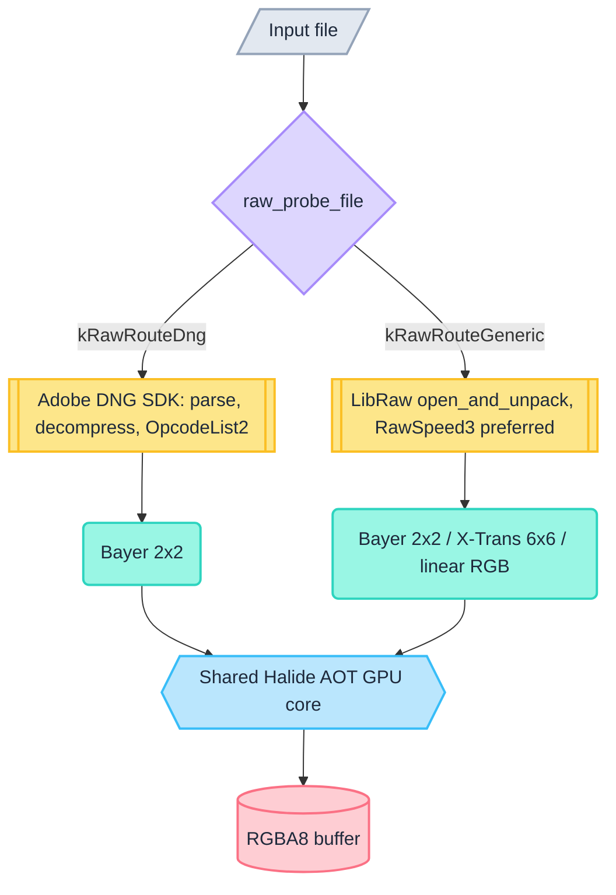
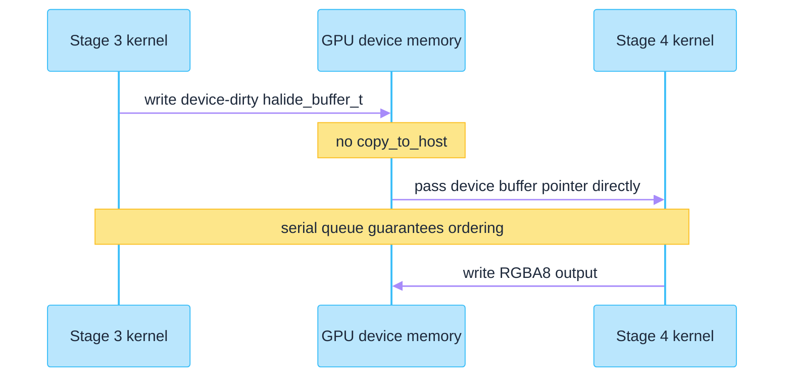

# Ceyx

Ceyx is a cross-platform, GPU-accelerated camera RAW decoding engine written in C++ and
Halide, packaged as a Flutter FFI plugin. It decodes DNG through the Adobe DNG SDK and a
broad range of proprietary RAW containers through LibRaw/RawSpeed3, runs demosaic, lens
correction and colour rendering as ahead-of-time compiled GPU kernels, and hands the
result to Dart without a memory copy.


*The bundled Flutter demo app (`app/`) decoding a 6000×4000 lossless DNG. The status bar
reports 291 ms for a cold first decode on an Apple M3 Ultra running macOS 15.6.1
(release build, 2026-08-26). This is a cold in-app measurement, not the warmed benchmark
figure in [Performance](#performance).*

---

## Table of contents

- [Why Ceyx](#why-ceyx)
- [Sister project: Halcyon](#sister-project-halcyon)
- [Supported formats and decoder backends](#supported-formats-and-decoder-backends)
- [Camera coverage](#camera-coverage)
- [Pipeline architecture](#pipeline-architecture)
- [FFI bridge and zero-copy design](#ffi-bridge-and-zero-copy-design)
- [GPU backends and platform support](#gpu-backends-and-platform-support)
- [Performance](#performance)
- [Precision and quality gates](#precision-and-quality-gates)
- [Building from source](#building-from-source)
- [Using Ceyx as a Flutter plugin](#using-ceyx-as-a-flutter-plugin)
- [Testing and QA tooling](#testing-and-qa-tooling)
- [Repository layout](#repository-layout)
- [Licensing and third-party attribution](#licensing-and-third-party-attribution)

---

## Why Ceyx

- **Colour fidelity is delegated, not approximated.** DNG parsing, opcode linearization
  and the reference colour maths stay inside the vendored Adobe DNG SDK, so documented
  DNG behaviour is preserved rather than re-implemented from a specification reading.
- **GPU-first, but honest about it.** Demosaic, lens warp and colour/tone rendering run
  as Halide AOT kernels on Metal or Vulkan. Where GPU execution structurally cannot match
  the CPU reference bit-for-bit, the residual is measured, published and explained
  instead of being hidden — see [Precision and quality gates](#precision-and-quality-gates).
- **One kernel set, two GPU APIs, three sensor layouts.** The same Halide generators are
  compiled per platform to Metal or Vulkan, and both decoder frontends converge on the
  same GPU core regardless of whether the file was a DNG, a Bayer RAW, an X-Trans RAW or
  a Foveon X3F.
- **Zero-copy at the Dart boundary.** Decoded RGBA buffers cross into Dart as a view over
  a caller-supplied native buffer with no `memcpy`. The buffer comes from and returns to a
  Dart-side pool (`CeyxNativeBufferPool`) via an explicit release call; a `NativeFinalizer`
  is attached only as a safety net for callers that forget to release.
- **Engine separated from application.** This repository is the reusable engine and
  plugin; a separate application consumes it under real product constraints.

## Sister project: Halcyon

Halcyon is a separate Flutter photo application that consumes Ceyx as an ordinary pub
`path:` dependency on this repository's `plugin/` directory. It is not a fork or a
subproject. Its Dart code touches exactly one import surface into this engine, and its
build and packaging scripts reference this repository's tree directly — which is why
restructuring work here is coordinated with Halcyon rather than done in isolation.

In short: Ceyx is the decoding engine and Flutter plugin, Halcyon is the real-world
consumer application built on top of it.

---

## Supported formats and decoder backends

Route selection is a byte-level probe of the file header, not a file-extension match.

| Route | Container | Frontend |
|---|---|---|
| DNG | TIFF-based with a `DNGVersion` tag in IFD0 | Adobe DNG SDK |
| Generic RAW | CR2, CR3, NEF, ARW, RAF, ORF, RW2, PEF, IIQ, MRW, X3F and other vendor containers | LibRaw, with RawSpeed3 as its preferred decode backend |

Three decoding libraries are vendored and built from source. They are not interchangeable
alternatives — each owns a distinct part of the problem:

- **Adobe DNG SDK** (`native/third_party/dng_sdk`) owns the DNG route end to end:
  metadata parsing, LJPEG tile decompression, and the OpcodeList linearization and
  lens-correction chain.
- **LibRaw** (`native/third_party/libraw`, gated by `DNG_ENABLE_GENERIC_RAW`) owns the
  generic RAW route: it opens the file and issues a single `unpack()` call.
- **RawSpeed3** (`native/third_party/libraw/RawSpeed3/rawspeed`) is used *inside* that
  LibRaw call as the preferred decoder. Ceyx never calls RawSpeed3 directly.

For the generic route, `LibRawFrontendContext::open_and_unpack()` sets `use_rawspeed` from
a forced-backend enum — `kAuto` tries RawSpeed3 first and silently falls back,
`kRawSpeed3` requires it, `kLibRawNative` disables it — and then reads back which decoder
actually produced the pixels from the `LIBRAW_WARN_RAWSPEED3_PROCESSED` warning bit after
the call. The RawSpeed3-vs-LibRaw decision is therefore observable per file, not assumed.

### Probing

`raw_probe_file()` (`native/src/pipeline/raw_file_router.cpp`) reads a small header window:

- Non-TIFF containers are matched on magic bytes and routed generic immediately:
  `FUJIFILMCCD-RAW` (Fujifilm RAF), `\0MRM` (Minolta MRW), `ftypcrx` / `ftypcr3`
  (Canon CR3), `IIU\0` / `IIRO` / `IIRS` (Phase One IIQ), `FOVb` (Foveon X3F).
- TIFF-based containers (`II`/`MM`, version 42) route to the DNG frontend only if IFD0
  carries the `DNGVersion` tag (id 50706) inside the probe window; otherwise they route
  generic. A DNG whose IFD0 sits outside the window is still decoded correctly by LibRaw
  — the mismatch surfaces as a diagnostic, not as a wrong decode.

### Sensor layout classes

Once pixels are unpacked, GPU dispatch keys on the colour-filter layout, never on vendor
or file format. The dispatch is an exhaustive switch with no fallthrough, so an
unrecognized layout cannot silently reach a demosaic kernel.

| Layout | Example sensors | GPU kernel |
|---|---|---|
| Bayer 2×2 (`kRawLayoutClassBayer2x2`) | the RGGB-family majority | `RawBayerDemosaicGenerator` |
| X-Trans 6×6 (`kRawLayoutClassXTrans6x6`) | Fujifilm X-Trans | `RawXTransDemosaicGenerator` |
| Linear RGB / no CFA (`kRawLayoutClassLinearRgb`) | Foveon X3F | `RawLinearRgbNormalizeGenerator` (normalize only, no demosaic) |

The X-Trans branch builds its 36-entry CFA pattern from LibRaw's `idata.xtrans_abs` when
`filters == 9`.

The linear-RGB branch is deliberately *not* a Foveon-specific check: the predicate is
`filters == 0 && colors == 3`, so any decoder returning a three-component interleaved
buffer reaches it and is treated identically. Foveon X3F decoding itself uses the
Kalpanika x3f-tools bundled inside LibRaw, force-enabled via `ENABLE_X3FTOOLS`.

The DNG route uses its own demosaic kernel (`DngDemosaicWarpGenerator`, fused with the
lens warp) rather than `RawBayerDemosaicGenerator` — the two Bayer demosaic
implementations are separate code, not a shared kernel.

### Still images: decode and encode

Ceyx is not RAW-only. Three additional Dart services in `plugin/lib/` cover ordinary
still-image formats: `HeifDecoderService`, `CeyxStillDecoderService` and
`CeyxEncodeService`.

**Decode** (`CeyxStillDecoderService`, native `still_ffi_api.cpp`) covers HEIC, AVIF,
WebP and JPEG XL, detected by a header probe rather than a file extension — the ISO-BMFF
`ftyp` brand distinguishes AVIF from the HEIC family. JPEG is deliberately reported
unsupported (`ceyx_still_decode_supports(kCeyxFormatJpeg)` returns 0): this surface has
no libjpeg decode arm, and Flutter's own engine already decodes JPEG, so answering "yes"
here would be a lie the capability model can't afford. `HeifDecoderService` is the
narrower HEIC-specific path over the same libheif stack; `CeyxStillDecoderService` is the
general one. Both expose `probeOnWorker` (dimensions without a full decode) and
`decodeOnWorker(path, {maxDim})` on a worker isolate, returning Dart-owned RGBA8. Unlike
EXIF-tagged JPEG, container transforms (rotation/mirroring) are applied *during* decode,
so the returned orientation is always 1 and the pixels are already display-ready.

**Encode** (`CeyxEncodeService`, native `encode_ffi_api.cpp`) takes RGBA8 in and produces
encoded bytes on a worker isolate, with optional EXIF/XMP/ICC metadata passthrough.
Per-format availability is a compile-time build gate, queried at runtime via
`CeyxEncodeService.supports(CeyxImageFormat)`:

| Format | Availability gate |
|---|---|
| JPEG | Always — libjpeg-turbo is linked on every platform |
| WebP | `CEYX_ENABLE_WEBP` |
| JPEG XL | `CEYX_ENABLE_JXL` |
| HEIC / AVIF | Only if the bundled libheif carries an encoder for that codec |

A missing symbol (older dylib) throws `CeyxEncodeUnavailableException`; a symbol that
exists but whose codec was excluded from this platform's build returns
`CeyxEncodeErrorCode.unsupported` instead. The two are deliberately distinct so a host
app can tell "this build can never do it" from "ask again after checking `supports()`".

## Camera coverage

Camera support for the generic RAW route comes from the vendored RawSpeed3 camera
database, `native/third_party/libraw/RawSpeed3/rawspeed/data/cameras.xml`:

- **1391** `<Camera>` entries
- **71** distinct raw `make=` strings
- **~41** distinct brands after normalizing case, stripping corporate suffixes and
  merging spelling variants

Counting method matters here. A naive `make="Canon"` grep over the whole file returns 399
hits, but only **209** of those are `<Camera>` entries; the remaining 190 are nested
`<ID>` elements mapping alternate model-name strings onto the same camera. All figures
below are scoped to `<Camera make="...">` opening tags.

| Brand | `<Camera>` entries |
|---|---|
| Panasonic | 308 |
| Canon | 209 |
| Nikon | 198 |
| Fujifilm | 131 |
| Sony | 110 |
| Leica | 96 |
| Olympus (incl. OM Digital Solutions) | 76 |
| Pentax | 40 |
| Samsung | 34 |
| Kodak | 32 |
| Phase One | 25 |
| Casio | 21 |
| Ricoh | 20 |
| Hasselblad | 16 |
| Leaf | 14 |
| Minolta / Konica Minolta | 10 |

The remaining long tail is mostly single-entry industrial, machine-vision, action-camera
and mobile-phone sensor makes (ARRI, AVT, Baumer, DJI, GITUP, LG, OnePlus, Sjcam, Sigma,
Sinar, Epson and others). The exact brand total depends on how aggressively spelling
variants are merged; 41 reflects merging OM Digital into Olympus and Konica Minolta into
Minolta.

---

## Pipeline architecture

### The four stages

| Stage | Role | Technology |
|---|---|---|
| 1 | Parse metadata, decompress Bayer tiles (LJPEG) | Adobe DNG SDK + libjpeg |
| 2 | OpcodeList2: linearization, black subtraction, pre-demosaic lens correction | Adobe DNG SDK / Halide opcode kernels |
| 3 | Demosaic Bayer→RGB, fused with `WarpRectilinear` (OpcodeList3) | Halide AOT (Metal / Vulkan) |
| 4 | Camera→sRGB matrix, tone mapping, fused EXIF orientation, 8-bit RGBA encode | Halide AOT (Metal / Vulkan) |

EXIF orientation is applied by permuting the OUTPUT coordinate back to the unoriented
coordinate before any pixel math runs (`DngRenderGenerator.cpp`), so it costs no extra pass
and no extra buffer. The kernel decides nothing about orientation: the host computes six
int32 affine coefficients (`ceyx_orient_affine_coeffs()`, `native/include/ceyx_orient.h`)
from the EXIF value, and the kernel evaluates one integer affine expression with no
orientation comparison or branch anywhere inside it. Decoded output is therefore
display-ready, which is why the still-image services report orientation `1` downstream.

### End-to-end dataflow

```mermaid
flowchart LR
    A[/"RAW file bytes"/] --> B[["Stage 1: parse metadata, decompress tiles"]]
    B --> C[["Stage 2: OpcodeList2 linearize, black subtract, lens correct"]]
    C --> D{{"Stage 3: demosaic + fused WarpRectilinear"}}
    D --> E{{"Stage 4: colour matrix, tone map, RGBA8 encode"}}
    E --> F[["extern C ceyx_decode_into_buffer_oriented"]]
    Z[("Dart: CeyxNativeBufferPool caller-allocated dst buffer")] -->|"dst pointer + capacity"| F
    F --> G[("dart:ffi DngResult: status + metrics, no pixel data")]
    G --> H[["DngDecoderService"]]
    F -.->|"decode fills dst in place"| I[("Zero-copy Uint8List view over that same dst buffer")]
    H --> I
    I --> J(["Flutter widget"])

    classDef input fill:#e2e8f0,stroke:#94a3b8,stroke-width:2px,color:#1e293b
    classDef cpu fill:#fde68a,stroke:#fbbf24,stroke-width:2px,color:#1e293b
    classDef gpu fill:#bae6fd,stroke:#38bdf8,stroke-width:2px,color:#1e293b
    classDef ffi fill:#ddd6fe,stroke:#a78bfa,stroke-width:2px,color:#1e293b
    classDef dart fill:#a7f3d0,stroke:#34d399,stroke-width:2px,color:#1e293b

    class A input
    class B,C cpu
    class D,E gpu
    class F,G ffi
    class Z,H,I,J dart
```



<sub>**Colour** — amber: CPU (Adobe DNG SDK) · sky: GPU (Halide AOT) · violet: FFI boundary · emerald: Dart/Flutter<br/>
**Shape** — parallelogram: file input · subroutine box: library/API call · hexagon: GPU kernel · cylinder: memory buffer · stadium: UI terminal<br/>
The destination buffer is allocated Dart-side and never allocated by the native library —
native code fills it in place; `DngResult` carries only status and timing, not pixel data.</sub>

### Dual-frontend routing

Both frontends converge on the same GPU core. Routing only decides which library parses
the container and unpacks samples — not which kernels process the pixels.



<sub>**Colour** — violet: route probe · amber: CPU frontends · teal: sensor layout class · sky: shared GPU core · rose: output<br/>
**Shape** — diamond: routing decision · subroutine box: library call · rounded: classification · hexagon: GPU kernel · cylinder: memory buffer</sub>

### GPU device handoff

Stage 3 hands its output to Stage 4 while the buffer is still resident in GPU memory.
There is no `copy_to_host` between them; the Metal serial queue guarantees ordering. All
three generic-route branches (Bayer, X-Trans, linear RGB) call the same shared Stage 4
entry point with the same device-dirty intermediate, so this is not a DNG-only
optimization.



One gotcha is load-bearing here: after `src_buf.crop()`, callers must mutate
`raw_buffer()->dim.min = 0` to match the generator's hard-coded `clamp(x, 0, ext-1)`.
Using `set_min` or `translate` instead triggers a `device_deallocate`.

Three further copy eliminations landed on the **generic RAW route** since this section was
first written. A per-lane persistent device arena (`raw_persistent_device_arena.cpp`) holds
per-thread-lane device-memory regions for the source mosaic, the Stage 3 RGB16 intermediate
and the RGBA8 destination, allocated lazily at the size actually needed and grown per lane
rather than reallocated on every decode. On unified-memory devices, a runtime capability
probe lets Stage 4 wrap the caller's own destination buffer as device memory directly, so
the kernel writes straight into the Dart-side pooled buffer and `halide_device_sync` takes
over the synchronisation role `copy_to_host` used to serve. A render-parameter upload cache
avoids re-uploading the twelve Stage 4 parameter buffers when they're unchanged from the
previous decode. Two qualifiers: the DNG route passes a null arena and is unaffected, and
every failure path on the generic route degrades to the pre-existing copying behaviour —
these are optimisations, not requirements.

### Halide AOT generators

All GPU kernels are compiled ahead of time at CMake build time — nothing is JIT compiled
at runtime. Generators live in `native/generators/` and are wired up in
`native/cmake/generators.cmake`.

| Generator | Produces | Role |
|---|---|---|
| `DngDemosaicWarpGenerator.cpp` | `DngDemosaicWarp` | DNG Stage 3, fused demosaic + warp; `strict_float` / `fast_codegen` schedule options |
| `DngDemosaicGenerator.cpp` | `DngDemosaicBilinear` | DNG bilinear demosaic fallback |
| `RectilinearWarpGenerator.cpp` | `RectilinearWarp` | Standalone lens-warp fallback |
| `DngOpcodePolynomialGenerator.cpp`, `DngOpcodePolynomial3Generator.cpp` | Stage 2 opcode kernels | OpcodeList2 `MapPolynomial` on GPU |
| `DngRenderGenerator.cpp` | `DngRenderStage4` and Android / scaled variants | Stage 4 render |
| `RawBayerDemosaicGenerator.cpp` | generic Bayer kernel | fused normalize + bilinear demosaic |
| `RawXTransDemosaicGenerator.cpp` | generic X-Trans kernel | fused normalize + 6×6 demosaic |
| `RawLinearRgbNormalizeGenerator.cpp` | generic linear-RGB kernel | normalize only |

A `research/` subtree holds diagnostics-only variants gated behind `DNG_DIAGNOSTIC_BUILD`;
they are not part of the production kernel set.

## FFI bridge and zero-copy design

```
native/src/ffi/dng_ffi_api.cpp   (extern "C")
  → libdng_decoder_native.dylib / .so
      → plugin/lib/src/dng_bindings.dart   (dart:ffi struct + lookupFunction)
          → plugin/lib/src/dng_decoder_service.dart   (DngDecoderService)
              → Flutter widget
```

**ABI contract.** `DngResult` has six fields and a compile-time pinned layout —
`sizeof(DngResult) == 40` on 64-bit, with `rgba_data` at offset 0, `width` at 8, `height`
at 12, `error_code` at 16, `decode_ms` at 24 and `process_ms` at 32, enforced by
`static_assert` in `native/include/dng_ffi_api.h`. The Dart mirror in `dng_bindings.dart`
must match field-for-field; that pairing is what "byte-exact struct" means in practice.
`rgba_data` now always points at a buffer the *caller* supplied — the library never
allocates full-resolution RGBA output on any path (see "Caller-owned buffers" below).

**Guarded symbol lookup.** Every native entry point is looked up inside `try`/`catch`, and
the corresponding capability getter reports `false` rather than throwing when a dylib
lacks the symbol. This cuts both ways:

- **Genuinely optional capability.** The generic-RAW entry `raw_decode_and_process` is
  absent on dylibs built without RAW support, so `rawDecodeAvailable` gates it correctly.
- **Legacy symbol, kept only for old-dylib tests.** `dng_decode_and_process`,
  `dng_decode_and_process_sized` and the debug counter `dng_debug_pool_checked_out` are
  entries every current dylib has deleted; they stay lookup-guarded only so the
  symbol-absence regression tests can still load old pinned dylibs that export them. A
  capability getter named after one of these legacy symbols answers "no" on every current
  build even though the feature it used to gate (sized decoding, RAW decoding) works fine
  through the current entry point — the actual availability check is re-pointed at
  `ceyx_decode_into_buffer`/`decodeIntoBufferAvailable` instead of the deleted symbol.

**Caller-owned buffers, zero-copy on success.** The native decode-into entries
(`ceyx_decode_into_buffer` family) write RGBA output into a buffer the Dart side supplies
— the library allocates nothing and frees nothing on the RGBA path. That buffer comes
from a fixed-slot Dart-side pool, `CeyxNativeBufferPool` (`plugin/lib/src/
native_buffer_pool.dart`): `acquire` hands out a native allocation immediately reusable
after `release`, sized generously enough (256MB default cap) that a full-resolution frame
is served from the pool rather than allocated fresh each decode. Requests above the cap
are served outside the pool and simply freed on release. The result `Uint8List` is a
zero-copy view over that buffer via `asTypedList` — no `memcpy` on the success path — and
the *intended* return route is an explicit `DngImage.releaseToPool()` call that hands the
buffer straight back to the free list. A `NativeFinalizer` is still attached, but only as
a safety net for callers that forget to release explicitly; in normal operation
`debugFinalizerReleases` stays at zero, and a non-zero value in a test is treated as a
defect, not an expected code path. The surrounding `DngResult` struct (not the RGBA data)
is still freed via `dng_free_result` in a `finally` block.

**Worker-isolate path.** A pool-backed buffer is tied to the isolate that acquired it and
cannot safely cross an isolate boundary, so `decodeOnWorker` copies into Dart-owned bytes
and moves them with `TransferableTypedData`, returning the pooled buffer to its isolate's
pool before the worker isolate exits.

**Idle shrink and OS-level memory return.** The shared pool does not just sit at its
fixed slot count forever: after a tunable period of continuous decode quiescence (5s in
production), `shrinkToFloor` releases idle slots down to a configurable `idleFloor`
(2 slots in production, versus 8 normally held). Demand regrows the pool for free
through the normal `acquire` path when decoding resumes.

`ceyx_pool_pressure_relief` — a native FFI entry — then asks the allocator to actually
return that freed memory to the OS rather than keep it in a process-level free list. The
mechanism, and what it returns, is platform-specific:

| Platform | Mechanism | Return value |
|---|---|---|
| Apple (macOS/iOS) | `malloc_zone_pressure_relief` | Actually returns pages to the OS |
| Linux (glibc) | `malloc_trim(0)` | Actually returns pages to the OS |
| Windows | Nothing — pooled buffers are large enough that `_aligned_free` already hands pages back at release time; the process-wide working-set trim is implemented one layer up, in the host app (Halcyon wires it to the pool's `onShrink` callback) | Deliberately returns `0`, not "unsupported" |
| musl / Android (bionic) | No equivalent mechanism exists | Explicit "unsupported" sentinel, not a silent zero |

---

## GPU backends and platform support

Ceyx targets exactly two GPU APIs: **Metal** and **Vulkan**. There is no OpenCL or CUDA
code in the tree, and there is no CPU render fallback — a working GPU backend is
mandatory.

Backend selection is a compile-time platform switch, not a runtime capability probe
(`native/src/pipeline/raw_gpu_pipeline.cpp`): Apple platforms get Metal, everything else
gets Vulkan.

| Platform | Halide AOT target |
|---|---|
| macOS / host | `host-metal-no_asserts-no_bounds_query` |
| Android | `arm-64-android-vulkan-vk_int8-vk_int16-vk_int64-no_asserts-no_bounds_query` |
| Windows | `x86-64-windows-vulkan-vk_int8-vk_int16-vk_int64-no_asserts-no_bounds_query` |

`no_asserts` and `no_bounds_query` strip runtime bounds checks from release kernels; the
`vk_int8` / `vk_int16` / `vk_int64` flags are the device contract required by the Vulkan
compute backend.

### Platform status

| Platform | GPU backend | Status |
|---|---|---|
| macOS | Metal | Shipping, verified |
| Android | Vulkan | Shipping, verified |
| Windows | Vulkan | Shipping, verified |
| iOS | Metal | Planned, pending CI/CD |
| Linux | Vulkan | Planned, pending CI/CD |

macOS, Android and Windows each have a native plugin directory with build wiring
(`plugin/macos`, `plugin/android`, `plugin/windows`) and a corresponding Flutter app
target.

The engine is written to be portable to iOS and Linux, and completing both is gated on
finishing the CI/CD pipeline rather than on any known technical blocker — but neither is
verified today. Concretely: `app/ios/` exists as a Flutter runner shell but there is no
`plugin/ios/`, and Linux has only a `qLinux=1` compile-definition branch with no
`app/linux/` or `plugin/linux/`.

### Android: persistent Vulkan pipeline cache

On Android, Halide v21's Vulkan runtime is forked (`native/halide_runtime_fork`, applied
by weak-symbol override) to persist the driver's `VkPipelineCache` across app launches.
Second-launch warmup drops from roughly 1500 ms to 141 ms.

---

## Performance

Every figure below is quoted with its measurement date and hardware. Cold-first-decode,
warm decode and app-cold are different measurement conditions and are not
interchangeable. The warmed matrix numbers are reproduced with:

```bash
python3 native/tests/run_decode_matrix.py --repeat 3
```

One caveat before comparing these figures against a downstream app's numbers: this table
times a **lossless DNG through the DNG SDK route**, where Stages 1–2 are SDK parse and
linearisation. A Sony ARW takes the generic-RAW route instead (RawSpeed3/LibRaw unpack
into the Halide GPU pipeline), which is a different amount of work on a different file —
on the same M3 Ultra, 2026-09-12, that route measured 72.9–76.6 ms end-to-end via the FFI
harness. Neither number is wrong; they are not the same measurement.

### macOS (Metal)

Warmed matrix on a 24 MP DNG, Apple M3 Ultra (28 cores), macOS 15.6.1, measured
2026-09-12 at commit `3a00692`. Each figure is a range across two full `--repeat 3` runs on
the *same* binary, on an otherwise idle machine:

| Measurement | Value | Previously published |
|---|---|---|
| Stage 3 fused, lossless | 76–81 ms | ~143 ms (2026-06-13, `e40ed7b`) |
| Stage 4, lossless | 46–50 ms | ~31–34 ms (2026-06-13, `e40ed7b`) |
| Stage 3, lossy | 0.0 ms (SDK YCbCr passthrough) | 0.0 ms |
| Stage 4, lossy | 46–48 ms | ~39 ms (2026-06-13, `e40ed7b`) |
| End-to-end, lossless (24 MP) | 160–171 ms | ~177 ms (2026-07-05) |
| End-to-end, lossy (24 MP) | 141–143 ms | ~105 ms (2026-07-05) |

> The two columns are not a before/after. The 2026-06/2026-07 rows record no chip model —
> only "Apple Silicon" — so they differ from the current column by hardware and by code at
> the same time, and the two causes cannot be separated. The right column exists only so
> the previously published figures stay traceable; the left column is the current baseline.
>
> The re-baseline was taken because the DNG Stage 3/4 scratch allocator was rebuilt onto a
> per-decode arena on 2026-09-04 (`7d99c3f9`, replacing the singleton
> `Stage3WorkspacePool`), with the decode-mutex removal it belongs to continuing through
> 2026-09-05 — changes that land squarely on the code these rows time. Correctness gates
> passed identically in every run: lossless Stage 3 102.71 dB, Stage 4 79.90 dB, all lossy
> stages 999 dB.
>
> The ranges are not decoration. Two runs of the same binary on the same idle machine, 26
> minutes apart, differed by up to 10% on the lossless path, and individual repeats inside
> one run have been seen to span 43.6–58.1 ms for a Stage 4 whose three-repeat mean was
> 45.8 ms. Treat any single figure here as accurate to roughly ±10%, and do not read a
> difference of that size — in either direction — as a code change.

See the demo screenshot caption above for the cold-app-start figure (291 ms) — it is not
comparable to the warmed matrix numbers below without accounting for warmup state.

### Android (Vulkan) — Adreno 750, Vulkan 1.3.128

| Measurement | Value | Measured | Note |
|---|---|---|---|
| Cold first decode | 905.2 ms | 2026-06-13 | down from 1353.7 ms (−33%) |
| Warm decode | 653 ms | 2026-06-13 | steady state, caches populated |
| Pipeline warmup | ~1050 ms | 2026-06-13 | down from ~6153 ms (−83%) |
| App-cold | 518–530 ms | 2026-07-05 | fresh process, warm on-disk pipeline cache |
| Second-launch warmup | 141 ms | 2026-07-05 | down from ~1500 ms, via persistent `VkPipelineCache` |

> Unlike the macOS table, this one has not been re-baselined, and cannot be from here: no
> Android device is attached to the machine these README figures were verified on. The
> dates above are the original measurement runs, all on the same Adreno 750 device.
>
> One later change is known to touch this path: the Stage 4 render kernels
> (`DngRenderGenerator.cpp`, shared between the Metal and Vulkan backends) absorbed EXIF
> orientation into the kernel after these runs. Whether that moved steady-state timing on
> this device is simply unknown — it is stated here rather than guessed at.

### Stage-level and per-format detail

- Stage 1, warm: 87.9 ± 3.8 ms on the Adreno 750 device, 2026-07-05 — 28.2% of that run's
  312 ms warm pipeline. Within Stage 1 itself, Huffman decode (`DecodeLosslessJPEG`) is
  74.0% of the wall time across 8 saturated threads, so CPU-side decompression, not GPU
  work, is what Stage 1 costs.
- Stage 4 `repack_src` elimination: 686 ms → 33 ms.
- **Fujifilm X-T5 RAF (40 MP): 1231 ms decompress, against 293 ms for an X-T3 RAF.** The
  gap is an upstream capability gap, not a dispatch problem: the pinned RawSpeed3 revision
  does not support that X-T5 body variant, so it reports `RAWSPEED_UNSUPPORTED` and the
  file automatically falls back to LibRaw's native unpacker. The X-T3 figure is the
  RawSpeed3 path.
- **Foveon X3F (Sigma sd Quattro H, 6208×4160): roughly 1.2–1.5 s per file.** This is an
  estimate — no dedicated timer instruments this path. The bottleneck is the vendored
  x3f-tools single-threaded CPU parse of a 68 MB file; the GPU normalize plus Stage 4
  together account for only tens of milliseconds.

The recurring theme across formats: GPU stages cost tens of milliseconds regardless of
format, and essentially all of the format-to-format variation is CPU-side decompression.

---

## Precision and quality gates

Ceyx measures decode correctness as PSNR against a reference buffer produced by the Adobe
DNG SDK's own CPU arithmetic. In this project's convention, **999 dB is a sentinel meaning
"bit-exact" (maximum absolute pixel difference of 0)**, emitted by `compare_psnr.py` when
two buffers are identical — it is not a physical measurement. Anything below it is a real
signal-to-noise ratio.

| Gate | Threshold | Measured |
|---|---|---|
| 24 MP DNG end-to-end wall clock | ≤ 600 ms | see [Performance](#performance) |
| Lossless Stage 3 (fused demosaic + warp) | ≥ 100 dB | 102.71–102.72 dB |
| Lossless Stage 4 (end-to-end) | ≥ 75 dB | 79.85–79.90 dB |
| Lossy, Stages 1–4 | 999 dB (bit-exact) | 999 dB |
| Generic RAW — Bayer kernel | 999 dB, max_abs 0 | 999 dB, max_abs 0 |
| Generic RAW — X-Trans kernel | — | 131.6–133.36 dB, max_abs 1 |
| Generic RAW — Foveon linear-RGB kernel | 999 dB, max_abs 0 | 999 dB, max_abs 0 |

The lossy path reaches bit-exactness. The lossless DNG path deliberately does not, for two
independent and separately diagnosed reasons.

### Why the lossless path is not bit-exact

**It is not because "the GPU is imprecise."** That intuition was investigated and refuted:
under `strict_float`, byte-comparison of Metal-compiled and CPU-compiled builds of the same
Halide kernels produces *identical* output. Both remaining residuals are
backend-independent.

#### 1. FMA contraction mismatch (Stage 4)

Apple's Metal compiler never auto-fuses multiply-add in this pipeline — Halide v21's Metal
runtime hardcodes `setFastMathEnabled:NO`, confirmed by disassembly, and a replay kernel
hit the stepwise `(a*b)+c` form on 4096 of 4096 evaluations with zero `fma` hits.

The Adobe DNG SDK reference, however, is compiled by Apple clang with its default
`-ffp-contract=on`, which *does* fuse the camera→sRGB matrix expression
`m00*A + m01*B + m02*C` into an `fma` — observed on 200000 of 200000 evaluations. So the
reference uses fused arithmetic that the GPU cannot emit, and the ~1 ULP difference
discretizes into sparse ±1 LSB pixel errors at the 8-bit encode step `g*255 + 0.5`.
Unmitigated, this caps Stage 4 at 99.6199 dB — and disabling FMA on the GPU side is not
an available lever, since Metal never fuses to begin with.

**Mitigation shipped.** The SDK reference itself is pinned to library-level
`-ffp-contract=off`, combined with `strict_float` on the Metal side. Library-level is
required — pinning individual translation units left 98 residual pixels, because the render
maths is header-inlined across several units and COMDAT folding still bound some callers to
a contracted copy.

> **Caveat, stated plainly.** That redefined reference is self-consistent stepwise
> arithmetic, not Adobe's factory `-ffp-contract=on` output. Against a real Adobe export,
> the pipeline still differs by 243 pixels at ±1 LSB. Matching factory output byte-for-byte
> would mean reverting this reference semantics or routing through a CPU SDK fallback.

#### 2. Coordinate quantization in the warp (Stage 3)

Stage 3's ~102.7 dB residual has nothing to do with FMA. The demosaic itself is bit-exact
against the SDK (999 dB, max_abs 0, including corner pixels) — the entire residual lives in
the `WarpRectilinear` layer, and decomposes into three parts:

1. **Sample-coordinate precision.** In-kernel 32-bit float coordinates versus the SDK's
   64-bit reals. Precomputing coordinates in host-side double precision removes this drift
   entirely: 102.72 dB → 135.74 dB (CPU) / 135.51 dB (Metal).
2. **Weight evaluation and accumulation order** in Halide IR versus the SDK's — sub-LSB,
   and again identical between Metal and CPU backends under `strict_float`.
3. **16-bit integer storage of the intermediate**, which is the hard ceiling.

### The only route to 999 dB, and why it was not taken

Reaching bit-exactness on the full lossless path means abandoning GPU execution for the
affected stages and recomputing with SDK-equivalent CPU arithmetic. That trades away the
GPU acceleration this pipeline exists for, in exchange for closing a gap that is already
far below visible difference. A synthesis route for the warp layer (host-double coordinates
plus the SDK weight table plus strict same-order accumulation) is documented but not
implemented; its cost is roughly 2.2 s of host-side precomputation.

### Colour alignment — a separate axis

Lightroom / ICC colour alignment is tracked independently and must not be read as a
pipeline-accuracy figure. Current measurement is ~26.10 dB under a **non-ICC-aware**
comparison, there is no formal gate for it yet, and the phase that would address ICC-aware
alignment is plan-only with no runtime code in the repository.

---

## Building from source

### One-time prerequisite

The vendored Halide v21 binary distribution (~540 MB) is not tracked in git — it exceeds
GitHub's 100 MB single-file limit. Fetch it once after cloning; the native build cannot
configure without it:

```bash
python3 native/scripts/build_deps.py fetch halide
```

### Native library

```bash
# Full configure + build (default target: test_decode)
python3 native/scripts/build_native_watchdog.py

# Specific target
python3 native/scripts/build_native_watchdog.py --target dng_decoder_native

# Skip configure for faster iteration
python3 native/scripts/build_native_watchdog.py --skip-configure --target test_decode
```

Or drive CMake directly:

```bash
cd native
cmake -S . -B build
cmake --build build --target <target> --parallel
```

### Flutter demo app

```bash
cd app
flutter run          # run on the host platform
flutter build macos  # release build
```

## Using Ceyx as a Flutter plugin

Ceyx is not published to pub.dev (`publish_to: none`). Host apps depend on it by path:

```yaml
dependencies:
  ceyx:
    path: ../ceyx/plugin
```

`plugin/` is both the public Dart API and the Flutter FFI plugin that makes the host build
system bundle the native library — CocoaPods embeds the dylib into
`<App>.app/Contents/Frameworks/` on macOS, Gradle packs the `.so` into the APK on Android.

Import `package:ceyx/ceyx.dart`; do not reach into `package:ceyx/src/...`. The public
surface, grouped by area:

- **RAW decode**: `DngDecoderService`, `DngImage`, `DngErrorCode`, `DngDecodeException`,
  the routing helpers (`DecodeRoute`, `decodeRouteForPath`, `kSupportedDecodeExtensions`),
  the generic-RAW error types (`RawErrorCode`, `RawDecodeException`,
  `RawUnavailableException`) and the diagnostic enums (`RawDiagnostics`, `RawFrontend`,
  `RawDecoderBackend`, `RawGpuBackend`, `RawSampleModel`).
- **Still decode**: `HeifDecoderService`, `HeifImage`, `HeifProbeResult`,
  `HeifErrorCode`/`HeifDecodeException`/`HeifUnavailableException` for HEIC; the general
  `CeyxStillDecoderService`, `CeyxStillImage`, `CeyxStillProbe` and
  `CeyxStillErrorCode`/`CeyxStillDecodeException`/`CeyxStillUnavailableException` for
  HEIC/AVIF/WebP/JPEG XL.
- **Encode**: `CeyxEncodeService`, `CeyxImageFormat`, `CeyxEncodeErrorCode`,
  `CeyxEncodeException`/`CeyxEncodeUnavailableException`.
- **Buffer/decode pool**: `CeyxNativeBufferPool`, `CeyxNativeBuffer` and
  `CeyxPoolShrinkPolicy`, plus `CeyxDecodePool` and its job/outcome types. These are
  exported so a host can inspect or override the shrink schedule, not because a host must
  assemble one — `CeyxDecodePool` wires the default itself.

### Minimal example

```dart
import 'package:ceyx/ceyx.dart';

Future<void> decodeOneFile(String filePath) async {
  final decoder = DngDecoderService();

  try {
    // Runs the native decode on a worker isolate so the UI isolate keeps painting;
    // the result carries Dart-owned bytes, safe to cross isolates.
    final DngImage image = await decoder.decodeOnWorker(filePath);
    print('${image.width}x${image.height}, '
        'decode ${image.decodeMs}ms, process ${image.processMs}ms');
    // image.rgbaData is a Uint8List of width * height * 4 bytes (RGBA8888).
  } on DngDecodeException catch (e) {
    print('Decode failed: ${e.errorCode} ${e.message}');
  }
}
```

`DngDecoderService.decode(filePath)` is the synchronous, genuinely zero-copy variant for
callers already off the UI isolate. It dispatches to the DNG or generic-RAW native entry
point via `decodeRouteForPath`, and throws `DngDecodeException` (DNG route) or
`RawDecodeException` / `RawUnavailableException` (generic route) on failure.

## Testing and QA tooling

The sample files below are **not** included in a clone — `image_samples/` ships only a
README. Point these commands at your own DNG and RAW files.

```bash
# Single-file 4-stage decode + PSNR
./native/build/test_decode image_samples/lossless_dng_sample.dng

# Regression matrix (lossless/lossy × stage1/full)
python3 native/tests/run_decode_matrix.py --repeat 3

# PSNR comparison of two raw buffers
python3 native/tests/compare_psnr.py \
  --ref lossless_stage3_6048x4024_1p.raw \
  --test halide_demosaic_output.raw \
  --width 6048 --height 4024 --planes 3

# Dart FFI smoke tests
cd app
dart run bin/benchmark_zero_copy.dart image_samples/lossless_dng_sample.dng
dart run bin/benchmark_preview.dart image_samples/lossless_dng_sample.dng

# Flutter widget tests
flutter test
```

`run_decode_matrix.py` auto-enables three additional harness cases whenever their binaries
exist — no flag needed:

```bash
python3 native/scripts/build_native_watchdog.py --skip-configure --target dng_ffi_harness
python3 native/scripts/build_native_watchdog.py --skip-configure --target test_device_handoff
python3 native/scripts/build_native_watchdog.py --skip-configure --target test_abi_layout
python3 native/tests/run_decode_matrix.py --repeat 3
```

- `dng_ffi_harness` drives the production `extern "C"` entry point
  (`ceyx_decode_into_buffer`) directly, gating the contract checks and a byte-exact RGB
  match.
- `test_device_handoff` calls `dng_pipeline_decode_to_rgb_into` directly and gates
  device-handoff PSNR (handoff on versus off) for the fused Stage 3 → Stage 4 path.
- `test_abi_layout` pins every offset/size in `DngResult`, `CeyxStillResult`,
  `CeyxEncodeOptions` and `HeifResult` (S-3), and the matrix separately asserts against
  the shipped dylib that the oracle-only `ceyx_orient_rgba` symbol never re-enters the
  production build (S-2), with a positive control proving the `nm` check itself works.

> **Coverage caveat.** Without all three binaries built, `run_decode_matrix.py` exercises
> only the internal test path — it does not gate the public FFI entry point, the device
> handoff, or the pinned ABI layout. This is not a "CPU fallback": no CPU render path
> exists. Build all three targets before treating a green matrix as coverage of the FFI,
> device-handoff and ABI-layout paths.

### Third-party provenance gate

`native/scripts/verify_raw_provenance.py` checks the vendored LibRaw and RawSpeed3 tree
against the pinned revisions, patch hashes and licenses recorded in
`native/third_party/libraw/PROVENANCE.md`. It is mechanical: exit 0 and
`[Provenance] ALL PASS` when the tree matches.

```bash
python3 native/scripts/verify_raw_provenance.py
```

## Repository layout

| Directory | Contents |
|---|---|
| `native/` | The C++ engine: pipeline (`src/pipeline/`), FFI surface (`src/ffi/`, `include/`), Halide generators (`generators/`), CMake config (`cmake/`), vendored dependencies (`third_party/`), the forked Halide Vulkan runtime used for Android pipeline-cache persistence (`halide_runtime_fork/`), patches applied to vendored sources (`patches/`, `sdk_patches/`), build and verification scripts (`scripts/`), tests (`tests/`) |
| `plugin/` | The `ceyx` Flutter FFI plugin: Dart bindings and decoder service (`lib/`), benchmark entry points (`bin/`), Dart tests (`test/`), and per-platform native packaging glue (`macos/`, `android/`, `windows/`) |
| `app/` | The Flutter demo application that exercises the plugin end to end, with per-platform runner shells |
| `docs/` | `legal/` (third-party license index) and `images/` (README screenshots) — that is all a clone contains. Development planning and task logs live under `docs/SOP/` and `docs/logs/` locally but are not published, so source comments citing those paths are internal cross-references you will not be able to follow. |
| `image_samples/` | **Contains no sample images.** The RAW and DNG files the test commands reference are untracked; only `raw_corpus/README.md`, which describes the corpus layout, is published. Supply your own files. |

## Licensing and third-party attribution

`plugin/` is a private, unpublished package. The prebuilt binaries it ships are builds of
the sources under `native/`, and the third-party components linked into them are indexed
in `docs/legal/THIRD_PARTY_LICENSES.md`.

| Component | License | Notes |
|---|---|---|
| Adobe DNG SDK | Adobe DNG SDK License Agreement | Compiled from source into the native library |
| Halide | MIT | Statically linked runtime; distribution fetched by `build_deps.py fetch halide` |
| LibRaw | LGPL-2.1 (elected; CDDL-1.0 also offered upstream) | Statically linked when `DNG_ENABLE_GENERIC_RAW=ON` |
| RawSpeed3 | LGPL-2.1 | Statically linked into the LibRaw target only |
| pugixml | MIT | Hash-pinned tarball fetched by RawSpeed3's build |
| LibRaw-cmake | MIT | Build-time CMake overlay; contributes no shipped source |
| libjpeg-turbo | IJG + modified 3-clause BSD (SIMD sources zlib-licensed) | Statically linked on every platform |
| zlib | zlib License | System zlib on macOS/Android; built from source on Windows |
| x3f-tools (Foveon X3F) | BSD-3-Clause | Bundled inside the vendored LibRaw tree |
| libheif | LGPL-3.0-or-later | Dynamically linked (`libheif.1.dylib` / `.so` / `heif.dll`), built by `python3 native/scripts/build_deps.py --component heif-stack` — kept out-of-process from `dng_decoder_native` to satisfy LGPL-3 §4(d)(1) |
| libde265 | LGPL-3.0-or-later | Dynamically linked, decode-only (`ENABLE_ENCODER=OFF`); HEVC intra decode behind libheif |
| kvazaar | BSD-3-Clause | HEVC encoder, statically linked into the shipped libheif (not a separate library file) |
| aom | BSD-2-Clause AND Alliance-for-Open-Media-Patent-License-1.0 | AV1 encode+decode, statically linked into libheif; the patent grant is separate from BSD-2, which is why the build vendors `PATENTS*` alongside `LICENSE*` |
| libwebp | BSD-3-Clause | Statically linked when `CEYX_ENABLE_WEBP` |
| libjxl | BSD-3-Clause | Statically linked when `CEYX_ENABLE_JXL` |

Exact pinned revisions and applied patch hashes are recorded in
`native/third_party/libraw/PROVENANCE.md` and gated by `verify_raw_provenance.py`.

> The table above is an index, not a substitute for the full license texts it points to.
> See `docs/legal/THIRD_PARTY_LICENSES.md` and the per-component `LICENSE` files under
> `native/third_party/`.
